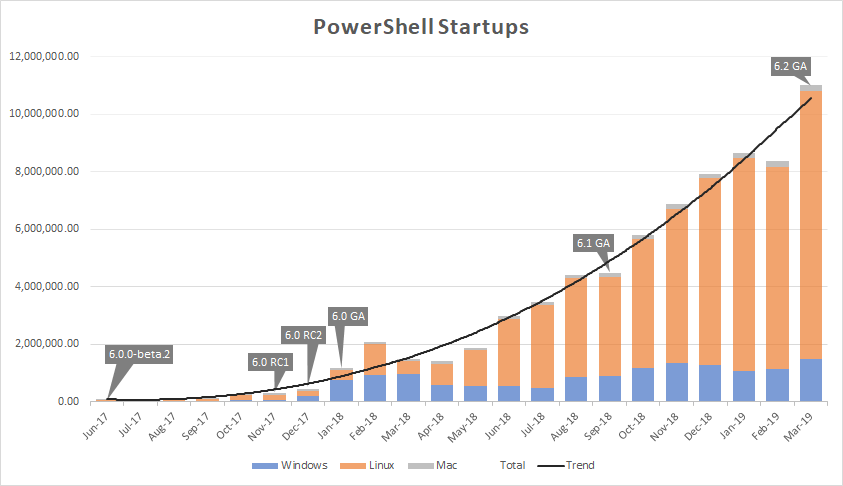
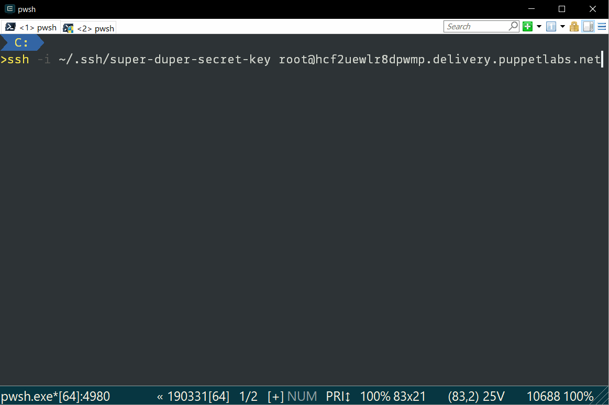
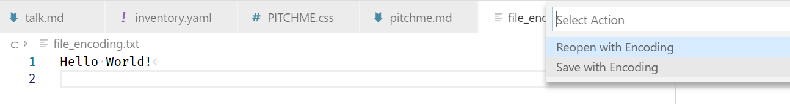

@snap[north span-50]
@img[title-logo](assets/img/summit_logo_with_text.png)
@snapend

## Using PowerShell in a Cross Platform World

With PowerShell Core you can do more!

@snap[south-west span-10]
@img[license](assets/img/license.png)
@snapend

++++++++++++++++++++++++++++++++++++++++++++++++++++++++++++++++++++++++++++++++?image=assets/img/summit_logo.png&position=top 2% left 5%&size=15%&opacity=30

@snap[north]
### Bio
@snapend

@snap[west span-45 bio]
#### James Pogran


[@ender2025](https://twitter.com/ender2025)
<br>
Windows Developer at Puppet.
<br>
Author of 'Learning PowerShell DSC'.
<br>
Co-Founder of lingua-pupuli
@snapend

@snap[east span-45 bio]
#### Bill Hurt


[@RandomNoun7](https://twitter.com/RandomNoun7)
<br>
Windows Developer at Puppet
<br>
Coordinator PDX PowerShell User Group
<br>
Not even close to an author.
@snapend

--------------------------------------------------------------------------------?image=assets/img/summit_logo.png&position=top 2% left 5%&size=15%&opacity=30

## PowerShell Release History

++++++++++++++++++++++++++++++++++++++++++++++++++++++++++++++++++++++++++++++++?image=assets/img/summit_logo.png&position=top 2% left 5%&size=15%&opacity=30

@snap[north]
### History
@snapend

@ul[spaced]
- Annual cadence from 2006 to 2016 with PS 5
- 2018 PS Core. Multiple Platforms. Multiple Versions
- PS Core 6.x releases have LTS releases and big speed improvements
- 6.x releases got 'Experimental Features'
- PowerShell ~~Core~~ 7
@ulend

Note:

- PS Core 6.1 released Sept 2018 ; .NET Core version up to 2.1 which is LTS release
- PS Core 6.2 GA March 2019

- Focused on Performance
- Background Jobs - 1..5 | %{Start-Job {Get-Process} ; Get-Job ; Wait-job}
  - 5.1 no threadjobs 1minute 30
  - 6 Regular background jobs twice as fast
  - Threadjobs 300 milliseconds

- Enable-ExperimentalFeature
- Temp:/ drive
- 7 Bundled in Windows some day.
- .Net Core 3
- Backward Compatibility

--------------------------------------------------------------------------------?image=assets/img/summit_logo.png&position=top 2% left 5%&size=15%&opacity=30

### PowerShell and .NET Core

@css[fragment](Together they make Cross Platform Possible)

++++++++++++++++++++++++++++++++++++++++++++++++++++++++++++++++++++++++++++++++?image=assets/img/summit_logo.png&position=top 2% left 5%&size=15%&opacity=30

@snap[north]
### .NET Core
@snapend

@snap[text-left]
A smaller, open source re-implementation of the .NET framework.
.NET Core covers a broad set of functionality that uses the native API's of the platform it's running on.
@snapend

Note:

This allowed the PowerShell team to port most of the PowerShell engine over and gain the ability to run PowerShell on multiple platforms, without changing much of the surface API you use.

++++++++++++++++++++++++++++++++++++++++++++++++++++++++++++++++++++++++++++++++?image=assets/img/summit_logo.png&position=top 2% left 5%&size=15%&opacity=30

@snap[north text-left span-80]
#### Some Things Aren't Quite There Yet

.NET Core is a totally new product, and you can't build everything at once.
@snapend

@snap[west span-40]
Missing APIs
@ul
- COM
- DCOM
- Some .NET calls
@ulend
@snapend

@snap[east span-40]
Missing Modules
@ul
- Active Directory
- Exchange
- SQL
@ulend
@snapend

++++++++++++++++++++++++++++++++++++++++++++++++++++++++++++++++++++++++++++++++?image=assets/img/summit_logo.png&position=top 2% left 5%&size=15%&opacity=30

@title[pwsh.exe]

pwsh.exe

Note:

This means there are now two products: Windows PowerShell and PowerShell Core.

Windows PowerShell will be pinned at 5.1, and only have security or major bugfixes released.

All new features and new work will be devoted to PowerShell Core.

Can't use POSH because it's an actively maintained linux project https://www.commandlinux.com/man-page/man1/posh.1.html
A bourne shell re-implementation

https://github.com/PowerShell/PowerShell/issues/4214

++++++++++++++++++++++++++++++++++++++++++++++++++++++++++++++++++++++++++++++++?image=assets/img/summit_logo.png&position=top 2% left 5%&size=15%&opacity=30

@snap[north span-80]
#### The Future?

**PowerShell 7**
@snapend

- .NET Core 3 promises to bring back many of the APIs required by modules that won't work in .NET Core 2

- Ship with Windows

- LTS and Non-LTS releases

@snap[south-east span-53]

@snapend

--------------------------------------------------------------------------------?image=assets/img/summit_logo.png&position=top 2% left 5%&size=15%&opacity=30

### Why Choose PowerShell?

++++++++++++++++++++++++++++++++++++++++++++++++++++++++++++++++++++++++++++++++?image=assets/img/summit_logo.png&position=top 2% left 5%&size=15%&opacity=30

@snap[north span-80]

#### Advantages of PowerShell

@snapend

@ul

- Designed as a Shell and a scripting language from the start
- Remoting
- Take your skills learned on Windows to other platforms

@ulend

++++++++++++++++++++++++++++++++++++++++++++++++++++++++++++++++++++++++++++++++?image=assets/img/summit_logo.png&position=top 2% left 5%&size=15%&opacity=30

@snap[north span-80]

#### Disadvantages of other languages

@snapend

@ul

- Difficult to install and use on Windows
- Windows hostile ecosystems

@ulend

--------------------------------------------------------------------------------?image=assets/img/summit_logo.png&position=top 2% left 5%&size=15%&opacity=30

### Installing PowerShell Core

++++++++++++++++++++++++++++++++++++++++++++++++++++++++++++++++++++++++++++++++?image=assets/img/summit_logo.png&position=top 2% left 5%&size=15%&opacity=30

@snap[north span-80]

#### Package Managers

@snapend

@ul

- macOS
  - *brew cask install powershell*
- Linux
  - *sudo apt-get install -y powershell*
  - *sudo yum install -y powershell*
  - *sudo dnf install -y powershell*
- Windows
  - *choco install powershell-core -y*

@ulend

Note:

Linux - https://docs.microsoft.com/en-us/powershell/scripting/install/installing-powershell-core-on-linux?view=powershell-6
Mac - https://docs.microsoft.com/en-us/powershell/scripting/install/installing-powershell-core-on-macos?view=powershell-6
Windows - https://docs.microsoft.com/en-us/powershell/scripting/install/installing-powershell-core-on-windows?view=powershell-6

++++++++++++++++++++++++++++++++++++++++++++++++++++++++++++++++++++++++++++++++?image=assets/img/summit_logo.png&position=top 2% left 5%&size=15%&opacity=30

@snap[north span-80]

#### A Small Script

@snapend

```
iex "& { $(irm https://aka.ms/install-powershell.ps1) } -UseMSI -Preview"
```

--------------------------------------------------------------------------------?image=assets/img/summit_logo.png&position=top 2% left 5%&size=15%&opacity=30

### What Good is This Thing?

++++++++++++++++++++++++++++++++++++++++++++++++++++++++++++++++++++++++++++++++?image=assets/img/summit_logo.png&position=top 2% left 5%&size=15%&opacity=30

@snap[north span-80]

#### What It's Good At

@snapend

@ul
- Interacting with Web Services
- Data Conversion and Manipulation
- CICD/Build/Deployment Scripts
- Pester
@ulend

++++++++++++++++++++++++++++++++++++++++++++++++++++++++++++++++++++++++++++++++?image=assets/img/summit_logo.png&position=top 2% left 5%&size=15%&opacity=30

@snap[north span-80]

#### Maybe Not As Good At

@snapend

@ul
- Deep System Integration
- Displaying Interfaces
- Colorized Output From Binaries
@ulend

Note:
Checkpoint-Computer
Service Cmdlets - Get-Service, etc.
Transactions

--------------------------------------------------------------------------------?image=assets/img/summit_logo.png&position=top 2% left 5%&size=15%&opacity=30

### Daily Use

++++++++++++++++++++++++++++++++++++++++++++++++++++++++++++++++++++++++++++++++?image=assets/img/summit_logo.png&position=top 2% left 5%&size=15%&opacity=30

@snap[north span-80]

#### Where to Put Stuff

@snapend

```powershell
/root> $env:PSModulePath -split [System.IO.Path]::PathSeparator
/root/.local/share/powershell/Modules
/usr/local/share/powershell/Modules
/opt/microsoft/powershell/6/Modules
```

```powershell
PS > $profile | fl * -for

AllUsersAllHosts       : /opt/microsoft/powershell/6/profile.ps1
AllUsersCurrentHost    : /opt/microsoft/powershell/6/Microsoft.PowerShell_profile.ps1
CurrentUserAllHosts    : /home/james/.config/powershell/profile.ps1
CurrentUserCurrentHost : /home/james/.config/powershell/Microsoft.PowerShell_profile.ps1
```

Note:

Notice the .config directory. That may seem strang if you aren't familair with the XDG Base Directory Specification https://specifications.freedesktop.org/basedir-spec/latest/index.html#introduction

++++++++++++++++++++++++++++++++++++++++++++++++++++++++++++++++++++++++++++++++?image=assets/img/summit_logo.png&position=top 2% left 5%&size=15%&opacity=30

@snap[north span-80]

#### File Properties

@snapend

Get-ChildItem won't show you everyting you might need to see about Linux files.

```powershell
PS > Get-ChildItem ./testfile
    Directory: /root

Mode                LastWriteTime         Length Name
----                -------------         ------ ----
------           4/20/19  5:23 AM              0 testfile
```

```bash
/root> ls -al ./testfile
-rwxr-xr-x 1 root root 0 Apr 20 05:23 ./testfile
```

Note:

Updated Get-ChildItem to work more like the *nix ls -R and the Windows DIR /S native commands. Get-ChildItem now returns the symbolic links encountered during a recursive search and does not search the directories that those links target.

++++++++++++++++++++++++++++++++++++++++++++++++++++++++++++++++++++++++++++++++?image=assets/img/summit_logo.png&position=top 2% left 5%&size=15%&opacity=30

@snap[north span-80]

#### pwsh as your default shell

@snapend
<br>


--------------------------------------------------------------------------------?image=assets/img/summit_logo.png&position=top 2% left 5%&size=15%&opacity=30

### Notes from The Field

++++++++++++++++++++++++++++++++++++++++++++++++++++++++++++++++++++++++++++++++?image=assets/img/summit_logo.png&position=top 2% left 5%&size=15%&opacity=30

@snap[north span-80]

#### Environment Variables

@snapend

Environment Variables on Linux are case sensitive, just like the file system.
PowerShell itself had to change a bit here, as in the case of the **$env:PSModulePath** variable.

Note:

https://github.com/PowerShell/PowerShell/pull/3255

++++++++++++++++++++++++++++++++++++++++++++++++++++++++++++++++++++++++++++++++?image=assets/img/summit_logo.png&position=top 2% left 5%&size=15%&opacity=30

@snap[north span-80]

#### Module Names

@snapend

Import-Module is a special case.

@ul

- Case Insensitive when using the module name only
- Case sensitive when providing a full path

@ulend

Note:

Modules are backed by directories, but that doesn't mean that module names should be slavishly treated like directory names.

https://github.com/PowerShell/PowerShell/pull/5097

++++++++++++++++++++++++++++++++++++++++++++++++++++++++++++++++++++++++++++++++?image=assets/img/summit_logo.png&position=top 2% left 5%&size=15%&opacity=30

@snap[north span-80]

#### Platform Variables

@snapend

A set of variables you can use in your scripts to determine if you are on Linux, Mac, or Windows.
**$IsLinux**, **$IsMacOS**, **$IsWindows**

@ul
- Regular variables, not $env: variables
- A regular variable like this is not case sensitive. Reads better to treat it that way anyway.
@ulend

++++++++++++++++++++++++++++++++++++++++++++++++++++++++++++++++++++++++++++++++?image=assets/img/summit_logo.png&position=top 2% left 5%&size=15%&opacity=30

@snap[north span-80]

#### Using Platform Variables

@snapend

```powershell
switch($true) {
    $IsWindows {  PSCore on Windows   }
    $IsLinux {}
    $IsMacOS {}
    default { Windows PowerShell }
}
```

Note:

Thanks very much to Tyler Leonhardt for this particular way to use a switch statement.

++++++++++++++++++++++++++++++++++++++++++++++++++++++++++++++++++++++++++++++++?image=assets/img/summit_logo.png&position=top 2% left 5%&size=15%&opacity=30

@snap[north span-80]

#### Need more Platform Information?

@snapend

ConvertFrom-StringData makes it super easy to get more detailed information if you need it.

```
 $LinuxInfo = Get-Content /etc/os-release -Raw | ConvertFrom-StringData

$environment += @{'LinuxInfo' = $LinuxInfo}
$environment += @{'IsUbuntu' = $LinuxInfo.ID -match 'ubuntu'}
$environment += @{'IsUbuntu14' = $Environment.IsUbuntu -and $LinuxInfo.VERSION_ID -match '14.04'}
$environment += @{'IsUbuntu16' = $Environment.IsUbuntu -and $LinuxInfo.VERSION_ID -match '16.04'}
$environment += @{'IsCentOS' = $LinuxInfo.ID -match 'centos' -and $LinuxInfo.VERSION_ID -match '7'}
$environment += @{'IsFedora' = $LinuxInfo.ID -match 'fedora' -and $LinuxInfo.VERSION_ID -ge 24}
$environment += @{'IsOpenSUSE' = $LinuxInfo.ID -match 'opensuse'}
$environment += @{'IsOpenSUSE13' = $Environment.IsOpenSUSE -and $LinuxInfo.VERSION_ID  -match '13'}
$environment += @{'IsOpenSUSE42.1' = $Environment.IsOpenSUSE -and $LinuxInfo.VERSION_ID  -match '42.1'}
$environment += @{'IsRedHatFamily' = $Environment.IsCentOS -or $Environment.IsFedora -or $Environment.IsOpenSUSE}
```

Note:

Thanks Marke Kraus - https://github.com/markekraus/PSRAW/blob/d93ca99d5bbf6ea924c3ba4f419ef394581b6e64/build.psm1#L6

++++++++++++++++++++++++++++++++++++++++++++++++++++++++++++++++++++++++++++++++?image=assets/img/summit_logo.png&position=top 2% left 5%&size=15%&opacity=30

@snap[north span-80]

#### File Encoding

@snapend

UTF-8 is going to be your best choice.

ASCII is your fallback in case of bugs.

Note:

This issue is mostly solved with later tools. Can be an issue again with older scripts that were first developed in PS ISE.

++++++++++++++++++++++++++++++++++++++++++++++++++++++++++++++++++++++++++++++++?image=assets/img/summit_logo.png&position=top 2% left 5%&size=15%&opacity=30

@snap[north span-80]

#### Detecting The Issue

@snapend

There are lots of `Get-TextEncoding` type scripts on the internet. Don't reinvent the wheel.

Lee Holmes has a good one in the [resource module](https://github.com/LeeHolmes/PowerShellCookbook) for his PowerShell Cookbook.

Note:

Lee Holmes - PowerShell Cookbook for a good encoding script: http://shop.oreilly.com/product/0636920024132.do

Fun fact. UTF7, UTF8 and ASCII are indistinguishable to this script. In fact there is no way to distinguish them until a UTF8 byte sequence is found
somewhere in the file. The `file` linux tool looks at the first 96KiB, but if the UTF8 sequence is somewhere else in the file it will simply return the incorrect encoding.

UTF8 with BOM can be distinguished, as the BOM is considered a signature, but it has no effect other than to act as a clue that the file is capable of containing UTF characters. The BOM in a UTF8 file (indeed in any file) will break the shebang interpreter directive discussed earlier.

++++++++++++++++++++++++++++++++++++++++++++++++++++++++++++++++++++++++++++++++?image=assets/img/summit_logo.png&position=top 2% left 5%&size=15%&opacity=30

@snap[north span-80]

#### What it looks like

@snapend


++++++++++++++++++++++++++++++++++++++++++++++++++++++++++++++++++++++++++++++++?image=assets/img/summit_logo.png&position=top 2% left 5%&size=15%&opacity=30

@snap[north span-80]

#### How to fix it

@snapend



```
PS >$content = Get-Content -Path ~/file_encoding.txt
PS >Set-Content -Path ~/file_encoding.txt -Value $content -Encoding utf8
```

++++++++++++++++++++++++++++++++++++++++++++++++++++++++++++++++++++++++++++++++?image=assets/img/summit_logo.png&position=top 2% left 5%&size=15%&opacity=30

@snap[north span-80]

#### How to prevent it

@snapend

@ul
- @size[.9em](PSDefaultParameterValues["Out-File:Encoding"] = "UTF8")
- Use modern editors
- Pay attention to your git diffs
@ulend

++++++++++++++++++++++++++++++++++++++++++++++++++++++++++++++++++++++++++++++++?image=assets/img/summit_logo.png&position=top 2% left 5%&size=15%&opacity=30

@snap[north span-80]

#### Line Endings

@snapend

@ul
- Most Windows apps will accept '\n'
- Most Linux shell programs will fail to read '\r\n'
- Install a VSCode extension to expose line endings
@ulend

++++++++++++++++++++++++++++++++++++++++++++++++++++++++++++++++++++++++++++++++?image=assets/img/summit_logo.png&position=top 2% left 5%&size=15%&opacity=30

@snap[north span-80]

#### Line Feed Won

@snapend

Consider dying on a different hill.

++++++++++++++++++++++++++++++++++++++++++++++++++++++++++++++++++++++++++++++++?image=assets/img/summit_logo.png&position=top 2% left 5%&size=15%&opacity=30

#### Paths

++++++++++++++++++++++++++++++++++++++++++++++++++++++++++++++++++++++++++++++++?image=assets/img/summit_logo.png&position=top 2% left 5%&size=15%&opacity=30

@snap[north span-80]

#### PowerShell Accepts '/'

@snapend

PowerShell normalizes paths even on Windows. You can use / almost everywhere.

++++++++++++++++++++++++++++++++++++++++++++++++++++++++++++++++++++++++++++++++?image=assets/img/summit_logo.png&position=top 2% left 5%&size=15%&opacity=30

@snap[north span-80]

#### Avoid Manually constructing paths

@snapend

Join-Path is your friend

```
$basepath = switch($true) {
  $IsWindows { $env:ProgramData }
  $IsLinux   {'/etc'}
}
Join-Path -Path $basepath -ChildPath puppet -AdditionalChildPath code,environments,production
```

Windows
```powershell
C:\ProgramData\puppet\code\environments\production
```

Linux
```powershell
/etc/puppet/code/environments/production
```

++++++++++++++++++++++++++++++++++++++++++++++++++++++++++++++++++++++++++++++++?image=assets/img/summit_logo.png&position=top 2% left 5%&size=15%&opacity=30

@snap[north span-80]

#### Aliases

@snapend

They aren't your friends.

They are not consistent between platforms, and some day soon [may go away completely](https://github.com/PowerShell/PowerShell-RFC/pull/129) unless you take specific steps to bring them back.

++++++++++++++++++++++++++++++++++++++++++++++++++++++++++++++++++++++++++++++++?image=assets/img/summit_logo.png&position=top 2% left 5%&size=15%&opacity=30

@snap[north span-80]

#### Already Gone

@snapend

ls, curl, mv, ps, rm, cp, sort, select, cat, man

Note:

Experimental Feature: PSUseAbbreviationExpansion

++++++++++++++++++++++++++++++++++++++++++++++++++++++++++++++++++++++++++++++++?image=assets/img/summit_logo.png&position=top 2% left 5%&size=15%&opacity=30

@snap[north span-80]

#### Still An Issue

@snapend

```powershell
PS /root> Get-Alias | `
  Where-Object -FilterScript {$NULL -ne (which $_.name)} | `
  Foreach-Object {[pscustomobject]@{cmd = which $_; name = $_.name; def = $_.definition}} | `
  Format-Table name, def, cmd -AutoSize

name def           cmd
---- ---           ---
dir  Get-ChildItem /bin/dir
echo Write-Output  /bin/echo
kill Stop-Process  /bin/kill
pwd  Get-Location  /bin/pwd
ri   Remove-Item   /usr/bin/ri
```

++++++++++++++++++++++++++++++++++++++++++++++++++++++++++++++++++++++++++++++++?image=assets/img/summit_logo.png&position=top 2% left 5%&size=15%&opacity=30

#### Some Cmdlets Have Changed

++++++++++++++++++++++++++++++++++++++++++++++++++++++++++++++++++++++++++++++++?image=assets/img/summit_logo.png&position=top 2% left 5%&size=15%&opacity=30

@snap[north span-80]

#### Get-Content

@snapend

#### Encoding Parameter
PowerShell 5.1 vs 6.2

```powershell
Ascii, BigEndianUnicode, BigEndianUTF32, Byte, Default, Oem, String, Unicode, Unknown, UTF32, UTF7, UTF8
```
```powershell
ascii, bigendianunicode, oem, unicode, utf7, utf8, utf8BOM, utf8NoBOM, utf32
```

++++++++++++++++++++++++++++++++++++++++++++++++++++++++++++++++++++++++++++++++?image=assets/img/summit_logo.png&position=top 2% left 5%&size=15%&opacity=30

@snap[north span-80]

#### Getting raw bytes

@snapend

PS 5.1
```powershell
Get-Content file.txt -Encoding byte
```
PS 6+
```powershell
Get-Content file.txt -AsByteStream -ReadCount 0
```

++++++++++++++++++++++++++++++++++++++++++++++++++++++++++++++++++++++++++++++++?image=assets/img/summit_logo.png&position=top 2% left 5%&size=15%&opacity=30

@snap[north span-80]

#### Splatting

@snapend

```powershell
$params = @{
  Path = './file.txt'
}

switch($true){
  $isCoreCLR { $params.AsByteStream = $true; $params.ReadCount = 0 }
  default { $params.Encoding = 'byte' }
}
Get-Content @params
```

++++++++++++++++++++++++++++++++++++++++++++++++++++++++++++++++++++++++++++++++?image=assets/img/summit_logo.png&position=top 2% left 5%&size=15%&opacity=30

@snap[north span-80]

#### When to use shebangs

@snapend

@color[green](#!/usr/bin/env pwsh)


**Interpreter Directive**

Tells a Linux type system which interpreter to use to execute a script.

Only works with PS Core, even on Windows.

Good for:
- Execute a script from the commandline
- Git hooks

Note:

Shebang must be followed by an 'LF' line ending. 'CRLF' line endings will cause the directive to fail and the script will not be launched.

++++++++++++++++++++++++++++++++++++++++++++++++++++++++++++++++++++++++++++++++?image=assets/img/summit_logo.png&position=top 2% left 5%&size=15%&opacity=30

@snap[north span-80]

#### Git Hooks

@snapend

[Git hooks](https://githooks.com/) are scripts that are triggered by git work flow events. They can run before a commit, called a pre-commit hook, or before a push called the pre-rebase hook, and others.

++++++++++++++++++++++++++++++++++++++++++++++++++++++++++++++++++++++++++++++++?image=assets/img/summit_logo.png&position=top 2% left 5%&size=15%&opacity=30

@snap[north span-80]

#### Git Hooks

@snapend

@title[Triggering the Hook]

Hooks must have a file name like the examples in a project's **.git/hooks** directory.
The Interpreter directive tells git which program to send the file name of the hook to
for execution.

--------------------------------------------------------------------------------?image=assets/img/summit_logo.png&position=top 2% left 5%&size=15%&opacity=30

# ?

---

@snap[north-west]
## **Thank you!**

Please use the event app or Sched.com to submit a session rating!
@snapend

@snap[south-west span-10]
@img[license](assets/img/license.png)
@snapend

@snap[south-east span-30]
@img[title-logo](assets/img/summit_logo_with_text.png)
@snapend
